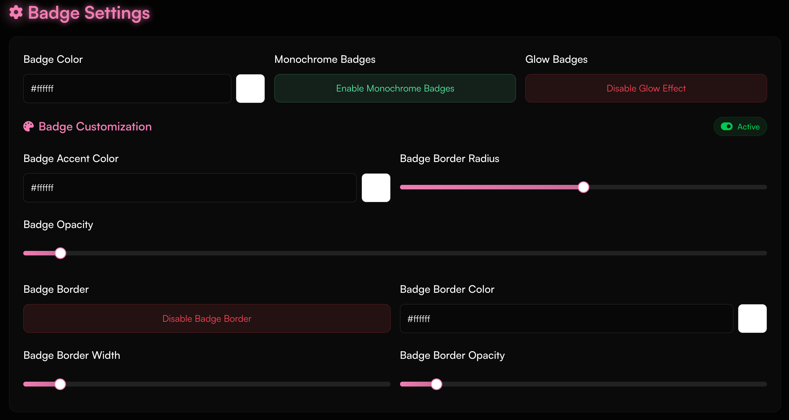
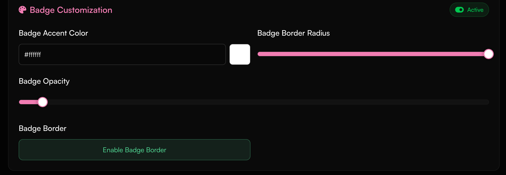

<Card title="Customize Badges" icon="circle-1" href="../customization/badges#badge-customization" horizontal>
Learn how to customize your profile badges.
</Card>

<Card title="Badges" icon="circle-2" href="../customization/badges#badges" horizontal>
View a list of all badges that exist on haunt.gg.
</Card>

## How can I customize my badges?

<Steps>
  <Step title="Open the Badge Settings Page">
    Visit [https://haunt.gg/dashboard/badges](https://haunt.gg/dashboard/badges)
    to get started.
  </Step>
</Steps>

---

# Badge Customization

<Steps>
  <Step title="Open the Section">
    Go to the **Badge Customization** section.
  </Step>
  <Step title="Start Customizing">
    You’ll find various options to personalize your badges—like glow, border,
    and layout tweaks.
  </Step>
</Steps>

<Frame>
  
</Frame>

---

### Badge Color Customization

<Steps>
  <Step title="Open the Color Settings">
    Go to the **Color Customization** section.
  </Step>
  <Step title="Explore the Options">
    The following features are available:
    - **Badge Color**: Select a base color using the color picker or hex input.
    - **Monochrome Badges**: Apply a singular badge color selected to the left for a cleaner look.
    - **Glow Badges**: Enable glowing outlines around your badges for extra emphasis.
    - **Edit Badge Color**: Set a specific badge color using a hex code or the color slider.
  </Step>
</Steps>

<Frame>
  
</Frame>

<Steps>
  <Step title="Open Badge Settings">Go to the **My Badges** section.</Step>
  <Step title="Explore the Options">
    The following features are available: - **Edit Badge Color**: Set a specific
    badge color in the hex code or slider selection menu. - **Reset to
    Default**: Will reset to default badge color.
  </Step>
</Steps>

<Frame>
  
</Frame>
<Frame>
  
</Frame>

<Note>
  If **Monochrome Badges** is enabled, it will override all other color
  settings—even custom ones.
</Note>

---

### Badge Card Customization

<Steps>
  <Step title="Access the Card Settings">
    Scroll to the **Badge Card** customization section.
  </Step>
  <Step title="Adjust Card-Specific Visuals">
    The badge cards (the containers holding the badge icons) have independent
    styling options: - **Accent Color**: Adds a subtle highlight around the
    badge frame. - **Border Radius**: Set how wide the corners of the card
    appear. - **Border Opacity**: Set how transparent the background of the
    badges appears. - **Badge Border**: Enable/disable the border.
  </Step>
</Steps>

<Frame>
  
</Frame>

<Note>
  Card customization affects the **background container** for badges, not the
  badge artwork itself.
</Note>

--- 

# Badges

### Owner Badge

<Frame caption="The owner badge is a badge that is given to the owners of haunt.gg.">
  <Badge icon="/assets/badges/owner.svg" color="purple">Owner</Badge>
</Frame>

### Manager Badge

<Frame caption="The manager badge is a badge that is given to managers of haunt.gg.">
  <Badge icon="/assets/badges/manager.svg" color="red">Manager</Badge>
</Frame>

### Staff Badge

<Frame caption="The staff badge is a badge that is given to staff members of haunt.gg.">
  <Badge icon="/assets/badges/staff.svg" color="blue">Staff</Badge>
</Frame>

<Note>
  You can apply to become a staff member during active apply phases [here](https://discord.gg/hauntbio).
</Note>

### Helper Badge

<Frame caption="The helper badge is a badge that is given to the helper of haunt.gg.">
  <Badge icon="/assets/badges/helper.svg" color="orange">Helper</Badge>
</Frame>

<Note>
  Helpers will be handpicked by the owner & managers. To be a helper, you should be active in the server and Help members in ⁠[support](https://discord.com/channels/1363890885443452989/1430903000028811324).
</Note>

---

### OG Badge

<Frame caption="The OG badge is a badge that is given to the original members of haunt.gg.">
  <Badge icon="/assets/badges/og.svg" color="yellow">OG</Badge>
</Frame>

<Note>This badge is no longer available to new users.</Note>

### Verified Badge

<Frame caption="The verified badge is a badge that is given to users who have been verified by haunt.gg.">
  <Badge icon="/assets/badges/verified.svg" color="blue">Verified</Badge>
</Frame>

<Note>
  You can purchase this badge [here](https://haunt.gg/pricing#verified) or learn
  [here](/guides/verification) how to verify your account.
</Note>

### Bug Hunter Badge

<Frame caption="The bug hunter badge is a badge that is given to users who have reported bugs to haunt.gg.">
  <Badge icon="/assets/badges/bug-hunter.svg" color="green">Bug Hunter</Badge>
</Frame>

<Note>
  You can report bugs [here](https://haunt.gg/dashboard/apply/d9d3a472-dc6f-479d-8ded-40e272698a73) (preferred) or via [Discord](https://discord.gg/hauntbio).
</Note>

### Donator Badge

<Frame caption="The donor badge is a badge that is given to users who have spent money on haunt.gg (multiple tiers).">
  <Badge icon="/assets/badges/donator/donator.svg" color="green">Donator</Badge>
</Frame>

<AccordionGroup>
<Accordion title="Fortune (50€)">
  <Frame caption="The donor badge is a badge that is given to users who have spent at least 50€ on haunt.gg.">
    <Badge icon="/assets/badges/donator/fortune.svg" color="surface-destructive">Fortune</Badge>
  </Frame>
</Accordion>
<Accordion title="Solar (100€)">
  <Frame caption="The donor badge is a badge that is given to users who have spent at least 100€ on haunt.gg.">
    <Badge icon="/assets/badges/donator/solar.svg" color="surface">Solar</Badge>
  </Frame>
</Accordion>
<Accordion title="Void (250€)">
  <Frame caption="The donor badge is a badge that is given to users who have spent at least 250€ on haunt.gg.">
    <Badge icon="/assets/badges/donator/void.svg" color="surface">Void</Badge>
  </Frame>
</Accordion>
</AccordionGroup>

### Premium Badge

<Frame caption="The premium badge is a badge that is given to users who have a premium subscription.">
  <Badge icon="/assets/badges/premium.svg" color="purple">Premium</Badge>
</Frame>

<Note>
  You can purchase a premium subscription [here](https://haunt.gg/pricing#premium).
</Note>

### Champion Badge

<Frame caption="The Champion Badge is a badge that is given to users who take place in the top 10 of the leaderboard.">
  <Badge icon="/assets/badges/champion.svg" color="yellow">Champion</Badge>
</Frame>

<Note>
  You can see the [leaderboard](https://haunt.gg/leaderboard) here.
</Note>

### Booster Badge

<Frame caption="The server booster badge is a badge that is given to users who have boosted our discord server.">
  <Badge icon="/assets/badges/discord/booster.svg" color="orange">Booster</Badge>
</Frame>

<Note>You can boost our server [here](https://discord.gg/hauntbio).</Note>

### Event Badges

<AccordionGroup>
<Accordion title="Winner">
  <Frame caption="The winner badge is given to anyone who won an event.">
    <Badge icon="/assets/badges/event/winner.svg" color="yellow">Winner</Badge>
  </Frame>
</Accordion>
<Accordion title="Second Place">
  <Frame caption="The second place badge is given to anyone who came in second place in an event.">
    <Badge icon="/assets/badges/event/second.svg" color="gray">Second Place</Badge>
  </Frame>
</Accordion>
<Accordion title="Third Place">
  <Frame caption="The third place badge is given to anyone who came in third place in an event.">
    <Badge icon="/assets/badges/event/third.svg" color="orange">Third Place</Badge>
  </Frame>
</Accordion>
</AccordionGroup>

### View Badges (Tiers)

<AccordionGroup>
<Accordion title="Noticed">
  <Frame caption="This badge is given for  reaching 100 views.">
    <Badge icon="/assets/badges/views/noticed.svg" color="surface">Noticed</Badge>
  </Frame>
</Accordion>
<Accordion title="Viral">
  <Frame caption="This badge is given for  reaching 1,000 views.">
    <Badge icon="/assets/badges/views/viral.svg" color="surface">Viral</Badge>
  </Frame>
</Accordion>
<Accordion title="All Eyes on Me">
  <Frame caption="This badge is given for  reaching 2,500 views.">
    <Badge icon="/assets/badges/views/all-eyes.svg" color="surface">All Eyes on Me</Badge>
  </Frame>
</Accordion>
<Accordion title="Main Character">
  <Frame caption="This badge is given for  reaching 5,000 views.">
    <Badge icon="/assets/badges/views/main-character.svg" color="surface">Main Character</Badge>
  </Frame>
</Accordion>
<Accordion title="Famous">
  <Frame caption="This badge is given for  reaching 10,000 views.">
    <Badge icon="/assets/badges/views/famous.svg" color="surface">Famous</Badge>
  </Frame>
</Accordion>
</AccordionGroup>

### Like Badges (Tiers)

<AccordionGroup>
<Accordion title="Liked">
  <Frame caption="This badge is given for  reaching 1 like.">
    <Badge icon="/assets/badges/likes/liked.svg" color="surface">Liked</Badge>
  </Frame>
</Accordion>
<Accordion title="Charming">
  <Frame caption="This badge is given for  reaching 10 likes.">
    <Badge icon="/assets/badges/likes/charming.svg" color="surface">Charming</Badge>
  </Frame>
</Accordion>
<Accordion title="Beloved">
  <Frame caption="This badge is given for  reaching 25 likes.">
    <Badge icon="/assets/badges/likes/beloved.svg" color="surface">Beloved</Badge>
  </Frame>
</Accordion>
<Accordion title="Heartthrob">
  <Frame caption="This badge is given for  reaching 50 likes.">
    <Badge icon="/assets/badges/likes/heartthrob.svg" color="surface">Heartthrob</Badge>
  </Frame>
</Accordion>
<Accordion title="Iconic">
  <Frame caption="This badge is given for  reaching 100 likes.">
    <Badge icon="/assets/badges/likes/iconic.svg" color="surface">Iconic</Badge>
  </Frame>
</Accordion>
</AccordionGroup>

### Domain Badge

<Frame caption="The Domain Badge is a badge that is given to users who donate a domain to haunt.">
  <Badge icon="/assets/badges/domain.svg" color="blue">Domain</Badge>
</Frame>

<Note>
  You can donate a domain [here](https://haunt.gg/dashboard/imagehost/overview) to earn this badge.
</Note>

### Gifter Badge

<Frame caption="Earned by gifting any product to another user.">
  <Badge icon="/assets/badges/gifter.svg" color="red">Gifter</Badge>
</Frame>

### Inviter Badge

<Frame caption="The inviter badge is awarded to users who refer 5 new members to haunt.gg using their affiliate link.">
  <Badge icon="/assets/badges/inviter.svg" color="surface">Inviter</Badge>
</Frame>

<Note>
  Earn this badge by successfully inviting **5 users** through your [affiliate
  link](https://haunt.gg/dashboard/apply/8). Join the affiliate program to start
  earning rewards and help grow the community.
</Note>

### Image Host Badge

<Frame caption="Earned by purchasing the Image Host storage extension">
  <Badge icon="/assets/badges/image-host.svg" color="surface">Image Host</Badge>
</Frame>

<Note>
  **Image Host storage extension** can be purchased [here](https://haunt.gg/pricing#imagehost).
</Note>

### Guild Tag Badge

<Frame caption="Earned by using our discord server tag">
  <Badge icon="/assets/badges/discord/guild-tag.svg" color="orange">Guild Tag</Badge>
</Frame>

<Note>
  You can join our Discord server [here](https://discord.gg/hauntbio).
</Note>

### Halloween Badge

<Frame caption="The Halloween Badge is a badge that is given to users who claim it during its release.">
  <Badge icon="/assets/badges/season/halloween.svg" color="orange">Halloween</Badge>
</Frame>

<Note>
  Exclusive badge from the halloween sale.
</Note>

### Christmas Badge

<Frame caption="The Christmas Badge is a badge that is given to users who claim it during its release.">
  <Badge icon="/assets/badges/season/christmas.svg" color="red">Christmas</Badge>
</Frame>

<Note>
  Exclusive badge from the christmas sale.
</Note>

### Easter Badge

<Frame caption="The Easter Badge is a badge that is given to users who claim it during its release.">
  <Badge icon="/assets/badges/season/easter.svg" color="surface">Easter</Badge>
</Frame>

<Note>
  Exclusive badge from the easter sale.
</Note>

### Voter Badge

<Frame caption="The Voter Badge is a badge that is given to users who vote in official haunt events.">
  <Badge icon="../assets/badges/voter.svg" color="yellow">Voter</Badge>
</Frame>

<Note>
  You can vote [here](https://haunt.gg/vote) when there is an ongoing event.
</Note>

### Custom Badges

<Frame caption="The custom badge is a badge that is given to users who have purchased a custom badge.">
  <Badge icon="question" color="surface">Custom</Badge>
</Frame>

<Note>
  When you purchase a [custom badge](https://haunt.gg/pricing#custom_badge), you can choose
  your own icon and name for the badge.
</Note>